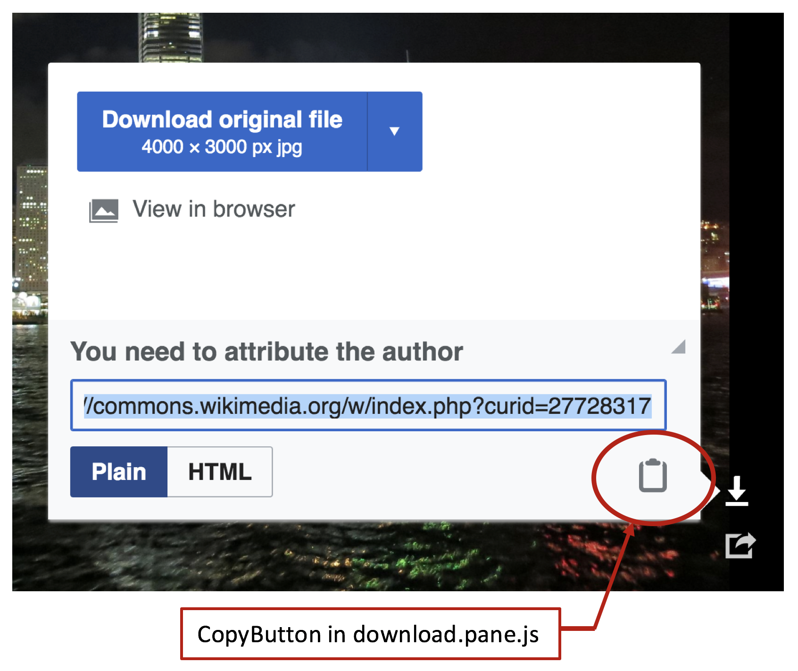
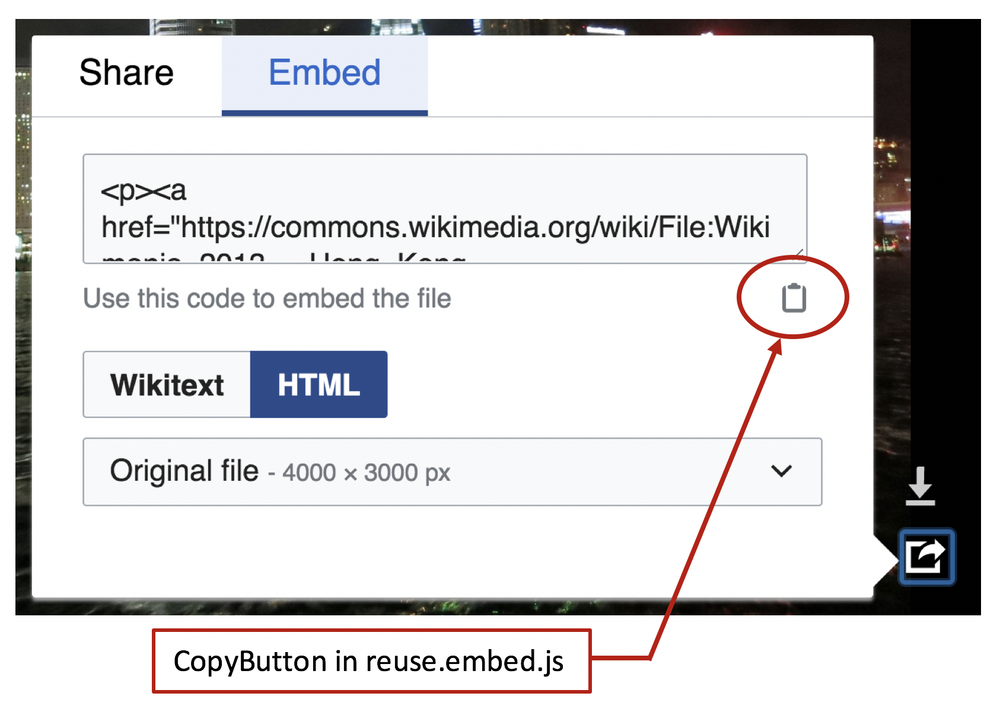
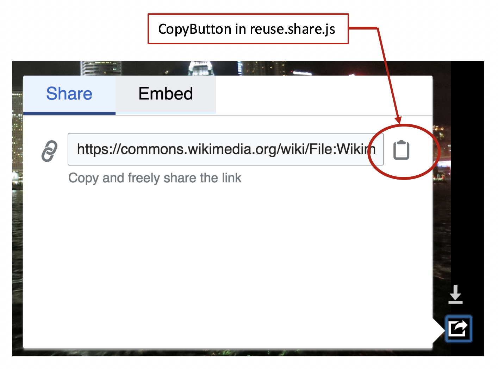
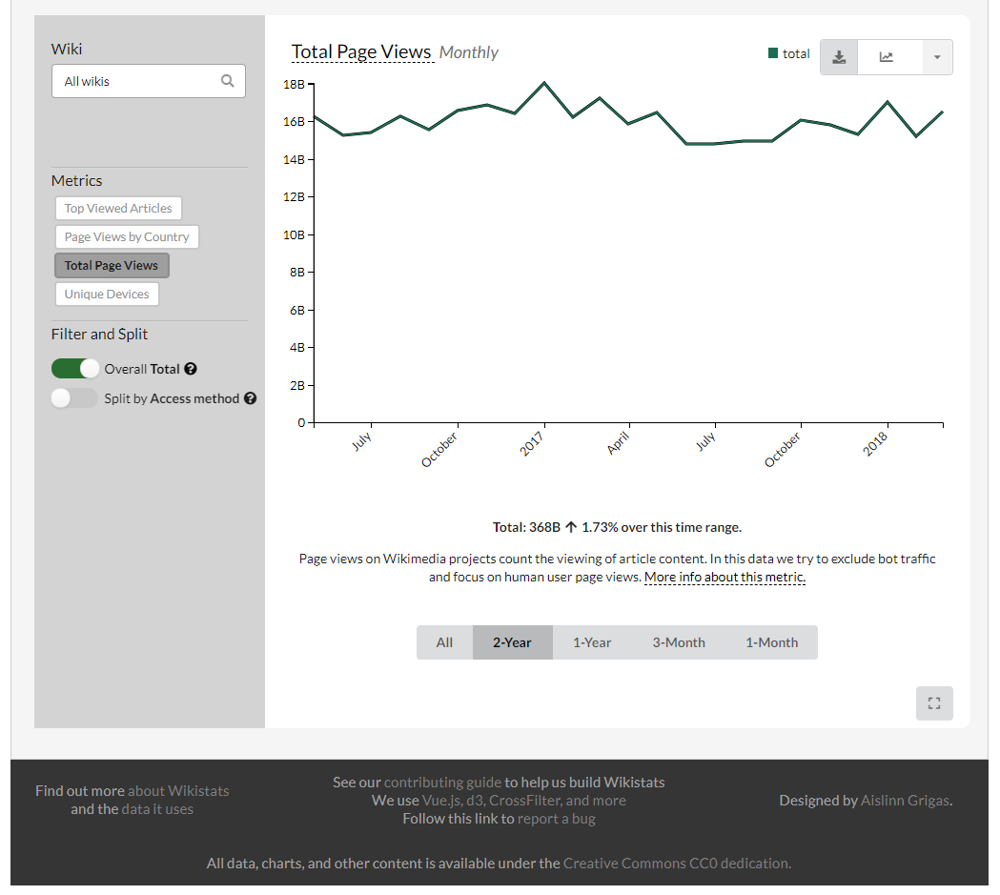
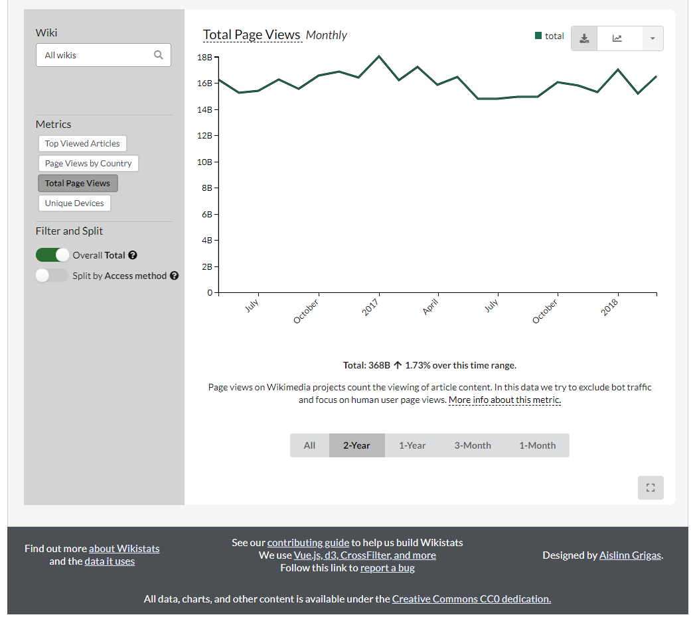

# MediaWiki Accessibility Product Deliverable

#### The Blue Wall Group:
    Jesse Buck  
    Daniel Collier  
    Michael Cornacchio  
    Hunter Hobbs  
    Jaziel Pauda  

#### Abstract:
The following document is a summary of the improvements we (Blue Wall Group) have made to the MediaWiki free open source software project. Our improvements addressed accessibility concerns existing within the MediaWiki core and its extensions. Three of our contributions have been integrated into the current version of the MediaWiki software. Furthermore, we have contributed four additional changes that are awaiting acceptance from project reviewers. These contributions were part of our senior capstone project during the Spring 2018 semester at Metropolitan State University of Denver.

#### Contents:
* [Fixing Interactive `<button>` Elements in the Multimedia Viewer Extension](#fixing-interactive-button-elements-in-the-multimedia-viewer-extension)
* [Adding Label to Input Field in Visual Editor Categories page](#adding-label-to-input-field-in-visual-editor-categories-page)
* [Correcting `<div>` tags to `<article>` tags in Flow Extension](#correcting-div-tags-to-article-tags-in-flow-extension)
* [Correcting HTML Heading Structure in QuizGame Extension](#correcting-html-heading-structure-in-quizgame-extension)
* [Integrating MediaWiki Color Palette into Wikistats 2.0](#integrating-mediawiki-color-palette-into-wikistats-20)
* [Resolving Wikistats 2.0 searchbar placeholder contrast and linting issues](#resolving-wikistats-20-searchbar-placeholder-contrast-and-linting-issues)
* [Correcting minor markup issues in Wikistats 2.0](#correcting-minor-markup-issues-in-wikistats-20)

***

### Fixing Interactive `<button>` Elements in the Multimedia Viewer Extension

#### Contributors:
* Hunter Hobbs
* Jaziel Pauda
* Jesse Buck

#### Status:
* This contribution was merged on 4/16/18 after 13 patch sets, and deployed on 4/17/18.

#### Description:
Interactive HTML elements that are not tagged correctly prevent accessibility hardware from communicating the functionality of the element to the user. This can lead to confusion and a poor experience for users with accessibility needs. Semantic HTML proposes writing DOM elements to give the user clear content on purpose and functionality. Some interactive `<button>` elements in the codebase for MultiMedia Viewer extension  were fixed reflect their functionality.

#### Visuals:
* Images showing button elements that were fixed:





#### Work Performed:
* Focused on the interactive button-like elements that were mentioned in the issue on Phabricator.
* Interactive button elements that were not `<button>`'s were converted to `<button>`'s.
* Elements that were button-like in appearance but functioned as a link were not converted.
* The `<div>` in `permission.js` was converted to a `<button>`.
* The `copyButton` in `download.pane.js` and `reuse.embed.js` needed a CSS class (`bootstrap.less`) to offset some labeling text so that it wouldn't interfere with the UI for users without accessibility needs.
* Any CSS files associated with elements that were changed were edited to keep the button-like element styling the same as it was prior to converting the tags.
* In addition to converting the elements, there was an `<a>`-button-like element in `StripeButtons.js` that was a link. This was not converted because it is a link and the rationale is that `<a>`-link elements are used to go from `page1` to `page2` while buttons are used as an interactive interface within the page. A `tabindex` attribute was added to the `StripeButton.js` `<a>` element to make it focusable by the keyboard for accessibility needs.

#### Code Changes:
* resources/mmv/mmv.bootstrap.less:
```diff
@@ -58,3 +58,12 @@
 		}
 	}
 }
+
+.mw-mmv-button {
+	background-color: transparent;
+	min-width: 0;
+	border: 0;
+	padding: 0;
+	overflow-x: hidden;
+	text-indent: -9999em;
+}
```

* resources/mmv/ui/mmv.ui.download.pane.js:
```diff
@@ -198,8 +198,8 @@
 			)
 			.appendTo( this.$attributionSection );
 		this.attributionInput = attributionInput;
-		this.$attributionCopy = this.$copyButton = $( '<a>' )
-			.addClass( 'mw-mmv-dialog-copy' )
+		this.$attributionCopy = this.$copyButton = $( '<button>' )
+			.addClass( 'mw-ui-button mw-mmv-button mw-mmv-dialog-copy' )
 			.click( function () {
 				// Select the text, and then try to copy the text.
 				// If the copy fails or is not supported, continue as if nothing had happened.
@@ -216,6 +216,7 @@
 				}
 			} )
 			.prop( 'title', mw.msg( 'multimediaviewer-download-attribution-copy' ) )
+			.text( mw.msg( 'multimediaviewer-download-attribution-copy' ) )
 			.tipsy( {
 				delayIn: mw.config.get( 'wgMultimediaViewer' ).tooltipDelay,
 				gravity: this.correctEW( 'se' )
```

* resources/mmv/ui/mmv.ui.permission.js:
```diff
@@ -96,7 +96,7 @@
 		 * "Close" button (does not actually close the box, just makes it smaller).
 		 * @property {jQuery}
 		 */
-		this.$close = $( '<div>' )
+		this.$close = $( '<button>' )
 			.addClass( 'mw-mmv-permission-close' )
 			.on( 'click', function () {
 				permission.shrink();
```

* resources/mmv/ui/mmv.ui.reuse.embed.js:
```diff
@@ -141,8 +141,8 @@
 			mw.mmv.actionLogger.log( 'embed-wikitext-copied' );
 		} );
 
-		this.$copyButton = $( '<a>' )
-			.addClass( 'mw-mmv-dialog-copy' )
+		this.$copyButton = $( '<button>' )
+			.addClass( 'mw-mmv-button mw-mmv-dialog-copy' )
 			.click( function () {
 				// Select the text, and then try to copy the text.
 				// If the copy fails or is not supported, continue as if nothing had happened.
@@ -159,6 +159,7 @@
 				}
 			} )
 			.prop( 'title', mw.msg( 'multimediaviewer-reuse-copy-embed' ) )
+			.text( mw.msg( 'multimediaviewer-reuse-copy-embed' ) )
 			.tipsy( {
 				delayIn: mw.config.get( 'wgMultimediaViewer' ).tooltipDelay,
 				gravity: this.correctEW( 'se' )
```

* resources/mmv/ui/mmv.ui.reuse.embed.less:
```diff
@@ -37,10 +37,9 @@
 
 	.mw-mmv-dialog-copy {
 		float: right;
-		width: 1em;
-		height: 1em;
-		margin: 10px 0.5em 20px 0;
-		padding: 0 0 0 5px;
+		width: 1.5em;
+		height: 1.5em;
+		margin: 10px 0.75em 20px 0.75em;
 	}
 }
 ```

* resources/mmv/ui/mmv.ui.reuse.share.js:
```diff
@@ -67,8 +67,8 @@
 				mw.mmv.actionLogger.log( 'share-page' );
 			} );
 
-		this.$copyButton = $( '<a>' )
-			.addClass( 'mw-mmv-dialog-copy' )
+		this.$copyButton = $( '<button>' )
+			.addClass( 'mw-mmv-button mw-mmv-dialog-copy' )
 			.click( function () {
 				// Select the text, and then try to copy the text.
 				// If the copy fails or is not supported, continue as if nothing had happened.
@@ -85,6 +85,7 @@
 				}
 			} )
 			.prop( 'title', mw.msg( 'multimediaviewer-reuse-copy-share' ) )
+			.text( mw.msg( 'multimediaviewer-reuse-copy-share' ) )
 			.tipsy( {
 				delayIn: mw.config.get( 'wgMultimediaViewer' ).tooltipDelay,
 				gravity: this.correctEW( 'se' )
```

* resources/mmv/ui/mmv.ui.reuse.share.less:
```diff
@@ -18,13 +18,12 @@
 	.mw-mmv-dialog-copy {
 		// style rules based on .mw-mmv-share-page-link
 		float: right;
-		width: 1.5em;
-		height: 1.5em;
+		width: 2em;
+		height: 2em;
 		// position approximately to the middle - probably fragile but couldn't find a better way as
 		// the height of OOUI input widget has both em and px parts and not possible to calculate
 		// exactly
-		margin: 8px 0.5em 8px 0;
-		padding: 0 0 0 5px;
+		margin: 8px 0.5em;
 	}
 }
 ```

* resources/mmv/ui/mmv.ui.stripeButtons.js:
```diff
@@ -59,7 +59,8 @@
 		$button = $( '<a>' )
 			.addClass( 'mw-mmv-stripe-button empty ' + cssClass )
 			// elements are right-floated so we use prepend instead of append to keep the order
-			.prependTo( this.$buttonContainer );
+			.prependTo( this.$buttonContainer )
+			.attr( 'tabindex', '0' );
 
 		return $button;
 	};
```

#### Links:
[Phabricator task](https://phabricator.wikimedia.org/T161612)

[Gerrit patch submission, review, and code diff](https://gerrit.wikimedia.org/r/#/c/408577/)

[Return to contents](#contents)

***
### Adding Label to Input Field in Visual Editor Categories page

#### Contributors:
* Jaziel Pauda
* Hunter Hobbs

#### Status:
This contribution was merged on 4/17/2018 after three patch sets and was deployed on 4/24/2018.

#### Description:
Labeling all `<input>` elements in a page improves the interactive experience of users with visual and cognitive disabilities. Furthermore, input labels provide additional content to assistive technologies. Previously, the input fields in the "Categories" section of the "Options" dialog page in Visual Editor relied on the input widget placeholders and user intuition to convey the necessary information  to understand the user interface and fulfill user tasks. An input label was added to the first input filed in the "Categories" page to fix this issue.

#### Visuals:
* Before adding category label:


* After adding category label:


#### Work Performed:
* The name of the new label for the category input field was added into the `extension.json` file of the extension.
* Next, the newly added message was defined by associating the label name with the English text that would be displayed to the user in the `en.json` file of the code base.
* The final step in adding this new label to the messages namespace of the extension was adding a description of the new message in the 'qqq.json' file that described the purpose of the label as well as the information it conveyed to the user so that this new label could be translated accurately into the different languages MediaWiki supports.
* The final step in the coding process was utilizing MediaWiki's OO JS UI library to add a new FieldLayout to the 've.ui.MWCategoriesPage.js' file that included the category input widget as well as the newly created label for that input widget to display the new elements together in the "Categories" page of the extension.

#### Changes:

* extension.json:
```diff
@@ -1693,6 +1693,7 @@
 				"visualeditor-categories-tool",
 				"visualeditor-dialog-meta-advancedsettings-label",
 				"visualeditor-dialog-meta-advancedsettings-section",
+				"visualeditor-dialog-meta-categories-addcategory-label",
 				"visualeditor-dialog-meta-categories-category",
 				"visualeditor-dialog-meta-categories-data-label",
 				"visualeditor-dialog-meta-categories-defaultsort-help",
```

* i18n/ve-mw/en.json:
```diff
@@ -151,6 +151,7 @@
 	"visualeditor-dialog-media-upload": "Upload",
 	"visualeditor-dialog-meta-advancedsettings-label": "Advanced settings",
 	"visualeditor-dialog-meta-advancedsettings-section": "Advanced settings",
+	"visualeditor-dialog-meta-categories-addcategory-label": "Add a category to this page",
 	"visualeditor-dialog-meta-categories-category": "Category",
 	"visualeditor-dialog-meta-categories-data-label": "Categories",
 	"visualeditor-dialog-meta-categories-defaultsort-help": "You can override how this page is sorted when displayed within a category by setting a different index to sort with instead. This is often used to make pages about people show by last name, but be named with their first name shown first.",
```

* i18n/ve-mw/qqq.json:
```diff
@@ -165,6 +165,7 @@
 	"visualeditor-dialog-media-upload": "Label for the upload button\n{{Identical|Upload}}",
 	"visualeditor-dialog-meta-advancedsettings-label": "Title for the advanced settings dialog section.\n{{Identical|Advanced settings}}",
 	"visualeditor-dialog-meta-advancedsettings-section": "Label for the advanced settings dialog section.\n{{Identical|Advanced settings}}",
+	"visualeditor-dialog-meta-categories-addcategory-label": "Label for field that adds a category to the page",
 	"visualeditor-dialog-meta-categories-category": "Title of popup for editing category options.\n{{Identical|Category}}",
 	"visualeditor-dialog-meta-categories-data-label": "Label for the categories sub-section.\n{{Identical|Category}}",
 	"visualeditor-dialog-meta-categories-defaultsort-help": "Message displayed as contextual help about the <nowiki>{{DEFAULTSORT:…}}</nowiki> control to editors in the page categories panel.",
```

* modules/ve-mw/ui/pages/ve.ui.MWCategoriesPage.js:
```diff
@@ -31,13 +31,25 @@
 		label: ve.msg( 'visualeditor-dialog-meta-categories-data-label' ),
 		icon: 'tag'
 	} );
+
 	this.categoryOptionsFieldset = new OO.ui.FieldsetLayout( {
 		label: ve.msg( 'visualeditor-dialog-meta-categories-options' ),
 		icon: 'advanced'
 	} );
+
 	this.categoryWidget = new ve.ui.MWCategoryWidget( {
 		$overlay: config.$overlay
 	} );
+
+	this.addCategory = new OO.ui.FieldLayout(
+		this.categoryWidget,
+		{
+			$overlay: config.$overlay,
+			align: 'top',
+			label: ve.msg( 'visualeditor-dialog-meta-categories-addcategory-label' )
+		}
+	);
+
 	this.defaultSortInput = new OO.ui.TextInputWidget( {
 		placeholder: this.fallbackDefaultSortKey
 	} );
@@ -64,7 +76,7 @@
 	} );
 
 	// Initialization
-	this.categoriesFieldset.$element.append( this.categoryWidget.$element );
+	this.categoriesFieldset.addItems( [ this.addCategory ] );
 	this.categoryOptionsFieldset.addItems( [ this.defaultSort ] );
 	this.$element.append( this.categoriesFieldset.$element, this.categoryOptionsFieldset.$element );
 };
```

#### Links:
[Phabricator issue ticket](https://phabricator.wikimedia.org/T146966)

[Gerrit patch submission, review, and code diff](https://gerrit.wikimedia.org/r/#/c/426139/)

[Overview of merge](https://google.com)

[Return to contents](#contents)

***

### Correcting `<div>` Tags to `<article>` Tags in Flow Extension

#### Contributors:
* Jaziel Pauda

#### Status:
This contribution was merged on 2/21/2018 after one patch set and was deployed on 2/27/2018.

#### Description:
MDN and W3 specify HTML conventions that ensure semantic HTML. These standards specify that the `<article>` tag is for forum posts, blog posts, news stories and comments. Within the MediaWiki Flow extension, several `<div>` elements needed to be changed into `<article>` elements in order to adhere to the above standards because they contained comments and forum posts.
#### Visuals:
Since this improvement consisted of only semantic HTML changes it involved no visual changes or representation.

#### Work performed:
* Verified, through W3 and MDN HTML standard specifications, that the correct semantic HTML tag for forum posts and comments are indeed `<article>` tags.
* `<div>` tags that needed to be fixed were identified by searching for the HTML tags that had the CSS classes "flow-post-content" and "mw-parser-output" because those classes are the ones applied to elements that contain the content of the forum posts and comments created by users with the Flow extension.
* Identified tags were changed to `<article>` tags.
* All PHP templates were recompiled using the command "make compile-lightncandy".

#### Code Changes:

* handlebars/compiled/flow_block_topic_moderate_post.handlebars.php:
```diff
@@ -159,9 +159,9 @@
 '.$sp.''.((LCRun3::ifvar($cx, ((isset($in['isModerated']) && is_array($in)) ? $in['isModerated'] : null))) ? '		<div class="flow-moderated-post-content">
 '.$sp.''.LCRun3::p($cx, 'flow_post_moderation_state', array(array($in),array()), '			').'		</div>
 '.$sp.'' : '').'
-'.$sp.'	<div class="flow-post-content mw-parser-output">
+'.$sp.'	<article class="flow-post-content mw-parser-output">
 '.$sp.'		'.LCRun3::ch($cx, 'escapeContent', array(array(((isset($in['content']['format']) && is_array($in['content'])) ? $in['content']['format'] : null),((isset($in['content']['content']) && is_array($in['content'])) ? $in['content']['content'] : null)),array()), 'encq').'
-'.$sp.'	</div>
+'.$sp.'	</article>
 '.$sp.'
 '.$sp.''.LCRun3::p($cx, 'flow_post_meta_actions', array(array($in),array()), '	').''.LCRun3::p($cx, 'flow_post_actions', array(array($in),array()), '	').'</div>
 ';},'flow_anon_warning' => function ($cx, $in, $sp) {return ''.$sp.'<div class="flow-anon-warning">
```

* handlebars/compiled/flow_block_topic_moderate_topic.handlebars.php:
```diff
@@ -159,9 +159,9 @@
 '.$sp.''.((LCRun3::ifvar($cx, ((isset($in['isModerated']) && is_array($in)) ? $in['isModerated'] : null))) ? '		<div class="flow-moderated-post-content">
 '.$sp.''.LCRun3::p($cx, 'flow_post_moderation_state', array(array($in),array()), '			').'		</div>
 '.$sp.'' : '').'
-'.$sp.'	<div class="flow-post-content mw-parser-output">
+'.$sp.'	<article class="flow-post-content mw-parser-output">
 '.$sp.'		'.LCRun3::ch($cx, 'escapeContent', array(array(((isset($in['content']['format']) && is_array($in['content'])) ? $in['content']['format'] : null),((isset($in['content']['content']) && is_array($in['content'])) ? $in['content']['content'] : null)),array()), 'encq').'
-'.$sp.'	</div>
+'.$sp.'	</article>
 '.$sp.'
 '.$sp.''.LCRun3::p($cx, 'flow_post_meta_actions', array(array($in),array()), '	').''.LCRun3::p($cx, 'flow_post_actions', array(array($in),array()), '	').'</div>
 ';},'flow_anon_warning' => function ($cx, $in, $sp) {return ''.$sp.'<div class="flow-anon-warning">
```

* handlebars/compiled/flow_post.handlebars.php:
```diff
@@ -137,9 +137,9 @@
 '.$sp.''.((LCRun3::ifvar($cx, ((isset($in['isModerated']) && is_array($in)) ? $in['isModerated'] : null))) ? '		<div class="flow-moderated-post-content">
 '.$sp.''.LCRun3::p($cx, 'flow_post_moderation_state', array(array($in),array()), '			').'		</div>
 '.$sp.'' : '').'
-'.$sp.'	<div class="flow-post-content mw-parser-output">
+'.$sp.'	<article class="flow-post-content mw-parser-output">
 '.$sp.'		'.LCRun3::ch($cx, 'escapeContent', array(array(((isset($in['content']['format']) && is_array($in['content'])) ? $in['content']['format'] : null),((isset($in['content']['content']) && is_array($in['content'])) ? $in['content']['content'] : null)),array()), 'encq').'
-'.$sp.'	</div>
+'.$sp.'	</article>
 '.$sp.'
 '.$sp.''.LCRun3::p($cx, 'flow_post_meta_actions', array(array($in),array()), '	').''.LCRun3::p($cx, 'flow_post_actions', array(array($in),array()), '	').'</div>
 ';},'flow_anon_warning' => function ($cx, $in, $sp) {return ''.$sp.'<div class="flow-anon-warning">
```

* handlebars/flow_post_inner.partial.handlebars:
```diff
@@ -11,9 +11,9 @@
 		</div>
 	{{/if}}
 
-	<div class="flow-post-content mw-parser-output">
+	<article class="flow-post-content mw-parser-output">
 		{{escapeContent content.format content.content}}
-	</div>
+	</article>
 
 	{{> flow_post_meta_actions}}
 	{{> flow_post_actions}}
```

#### Links:
[Phabricator task](https://phabricator.wikimedia.org/T175937)

[Gerrit patch submission, review, and code diff](https://gerrit.wikimedia.org/r/#/c/413091/)

[Overview of merge](https://phabricator.wikimedia.org/rEFLWa703662e1c62c251ad1e83bf0b84715dfb5ff437)

[Return to contents](#contents)

***

### Correcting HTML Heading Structure in QuizGame Extension

#### Contributors:
* Jaziel Pauda

#### Status:
This contribution is awaiting feedback as of 4/20/2018 after two patch sets.

#### Description:
MediaWiki HTML standards specify that there must not be more than one `<h1>` heading per page. This specification facilitates accurate screen reader navigation, maintains a separation between navigation and content, and ensures a logical heading structure. The home page of the MediaWiki QuizGame extension was structured entirely with `<h1>` headings. All those headings needed to be changed to `<h2>` elements in order to comply with the mentioned accessibility standards. 

#### Visuals:
Since this improvement consisted of only semantic HTML changes it involved no visual changes or representation.

#### Work performed:
* The work performed started with determining if the home page of the QuizGame extension was indeed structured with multiple `<h1>` headings.
* After this verification, the intended layout of this page was examined to determine if any of the headings on the page were nested section headings or were headings for separate sections.
* After it was determined that each heading represented the introduction of new independent section of the home page, each of the `<h1>` headings was changed to a `<h2>` heading.
* Finally, CSS classes that selected the various `<h1>` tags were removed from the code because the styling they applied to the headings were no longer needed with the new heading structure.

#### Changes:

* includes/specials/SpecialQuizGameHome.php:
```diff
@@ -418,10 +418,10 @@
 						$this->msg( 'quizgame-admin-back' )->text() . '</a>
 				</div>
 
-				<h1>' . $this->msg( 'quizgame-admin-flagged' )->text() . "</h1>
+				<h2>' . $this->msg( 'quizgame-admin-flagged' )->text() . "</h2>
 				{$flaggedQuestions}
 
-				<h1>" . $this->msg( 'quizgame-admin-protected' )->text() . "</h1>
+				<h2>" . $this->msg( 'quizgame-admin-protected' )->text() . "</h2>
 				{$protectedQuestions}
 
 			</div>";
@@ -671,7 +671,7 @@
 						'">
 
 						<div class="credit-box" id="creditBox">
-							<h1>' . $this->msg( 'quizgame-submitted-by' )->text() . "</h1>
+							<h2>' . $this->msg( 'quizgame-submitted-by' )->text() . "</h2>
 
 							<div id=\"submitted-by-image\" class=\"submitted-by-image\">
 							<a href=\"{$user_title->getFullURL()}\">
@@ -702,13 +702,13 @@
 
 						<div class=\"ajax-messages\" id=\"ajax-messages\" style=\"margin:20px 0px 15px 0px;\"></div>
 
-						<h1>" . $this->msg( 'quizgame-question' )->text() . "</h1>
+						<h2>" . $this->msg( 'quizgame-question' )->text() . "</h2>
 						<input name=\"quizgame-question\" id=\"quizgame-question\" type=\"text\" value=\"" .
 							htmlspecialchars( $question['text'], ENT_QUOTES ) . "\" size=\"64\" />
-						<h1>" . $this->msg( 'quizgame-answers' )->text() . "</h1>
+						<h2>" . $this->msg( 'quizgame-answers' )->text() . "</h2>
 						<div style=\"margin:10px 0px;\">" . $this->msg( 'quizgame-correct-answer-checked' )->text() . "</div>
 						{$quizOptions}
-						<h1>" . $this->msg( 'quizgame-picture' )->text() . "</h1>
+						<h2>" . $this->msg( 'quizgame-picture' )->text() . "</h2>
 						<div class=\"quizgame-edit-picture\" id=\"quizgame-edit-picture\">
 							{$pictag}
 						</div>
@@ -1170,7 +1170,7 @@
 						"</a>
 					</div>
 					<div class=\"credit-box\" id=\"creditBox\">
-						<h1>" . $this->msg( 'quizgame-submitted-by' )->text() . "</h1>
+						<h2>" . $this->msg( 'quizgame-submitted-by' )->text() . "</h2>
 
 						<div id=\"submitted-by-image\" class=\"submitted-by-image\">
 							<a href=\"{$user_title->getFullURL()}\">
@@ -1363,9 +1363,9 @@
 					htmlspecialchars( $this->getPageTitle()->getFullURL( 'questionGameAction=createGame' ) ) . '">
 				<div id="quiz-game-errors" style="color:red"></div>
 
-				<h1>' . $this->msg( 'quizgame-create-write-question' )->text() . '</h1>
+				<h2>' . $this->msg( 'quizgame-create-write-question' )->text() . '</h2>
 				<input name="quizgame-question" id="quizgame-question" type="text" value="" size="64" />
-				<h1 class="write-answer">' . $this->msg( 'quizgame-create-write-answers' )->text() . '</h1>
+				<h2 class="write-answer">' . $this->msg( 'quizgame-create-write-answers' )->text() . '</h2>
 				<span style="margin-top:10px;">' . $this->msg( 'quizgame-create-check-correct' )->text() . '</span>
 				<span style="display:none;" id="this-is-the-welcome-page"></span>';
 		// the span#this-is-the-welcome-page element is an epic hack for JS
@@ -1389,8 +1389,8 @@
 
 			'</form>
 
-			<h1 style="margin-top:20px">' .
-				$this->msg( 'quizgame-create-add-picture' )->text() . '</h1>
+			<h2 style="margin-top:20px">' .
+				$this->msg( 'quizgame-create-add-picture' )->text() . '</h2>
 			<div id="quizgame-picture-upload">
 
 				<div id="real-form">
```

* resources/css/questiongame.css:
```diff
@@ -28,14 +28,6 @@
 	padding: 0 0 0 2px;
 }
 
-.quizgame-edit-question h1 {
-	font-size: 16px;
-	font-weight: bold;
-	border-bottom: none;
-	color: #333;
-	margin: 20px 0 10px 0 !important;
-}
-
 .quizgame-picture img {
 	border: 1px solid #dcdcdc;
 	padding: 3px;
@@ -103,13 +95,6 @@
 	padding: 10px 0 0 0;
 }
 
-.quizgame-admin h1 {
-	font-size: 18px;
-	color: #333;
-	font-weight: bold;
-	margin: 0 0 20px 0 !important;
-}
-
 .quizgame-admin-top-links {
 	margin: -10px 0 20px 0;
 }
@@ -124,13 +109,6 @@
 	margin: 0 0 20px 0;
 	padding: 0 0 20px 0;
 	width: 500px;
-}
-
-.quizgame-flagged-item h1 {
-	font-size: 14px;
-	font-weight: bold;
-	color: #333;
-	margin: 0 0 10px 0 !important;
 }
 
 .quizgame-flagged-picture img {
@@ -253,15 +231,6 @@
 	margin: 8px 0 0;
 	padding: 10px;
 	padding-bottom: 60px;
-}
-
-.credit-box h1 {
-	border-bottom: none;
-	color: #333;
-	font-size: 16px;
-	font-weight: bold;
-	padding: 0;
-	margin: 0 0 10px !important;
 }
 
 .last-game {
@@ -406,27 +375,6 @@
 	border: 1px solid #dcdcdc;
 	padding: 9px;
 	width: 500px;
-}
-
-.create-message h1 {
-	font-size: 22px;
-	border-bottom: none;
-	font-weight: bold;
-	margin: 0 0 10px !important;
-}
-
-.quizgame-create-form h1 {
-	color: #333;
-	font-size: 16px;
-	font-weight: bold;
-	border-bottom: none;
-	margin: 20px 0 15px 0 !important;
-}
-
-h1.write-answer {
-	color: #333;
-	font-size: 16px;
-	margin: 20px 0 10px 0 !important;
 }
 
 .quizgame-answer-number {
```

#### Links:
[Phabricator task](https://phabricator.wikimedia.org/T156450)

[Gerrit patch submission, review, and code diff](https://gerrit.wikimedia.org/r/#/c/416887/)

[Return to contents](#contents)

***

### Integrating MediaWiki Color Palette into Wikistats 2.0

#### Contributors:
* Jesse Buck

#### Status:
This contribution is awaiting feedback as of 4/20/2018 after two patch sets.

#### Description:
Page text which has low contrast with the background can be difficult to read, and presents an accessibility barrier. Wikistats 2.0 had several areas with poor contrast. In particular, its footer area and several text elements had inadequate contrast according to W3C standards. These colors needed to be changed to be WCAG compliant, using colors sourced from an existing MediaWiki color palette. Additionally, as a result of the color changes in the footer area, underlines needed to be added to the footer links to further distinguish them from surrounding text.

#### Visuals:
* Before contrast changes:

* After contrast changes:


#### Work performed:
* Changed the color of several subdued text elements.
* Changed the color of text and links within the footer area.
* Changed the background color of the footer area.
* Added underlines to links in the footer area.

#### Changes:
* src/App.vue
```diff
@@ -138,8 +138,8 @@
     border-bottom: none;
 }
 .ui.attached.footer.segment {
-    background-color: #3B3B3B;
-    color: #AAAAAA;
+    background-color: #54595d;
+    color: #fff;
     border: none;
 }
 ```
 
* src/components/BottomFooter.vue:
```diff
@@ -32,6 +32,9 @@
 </script>
 
 <style scoped>
-a, a:visited { color: #888; }
+a, a:visited {
+    color: #eaf3ff;
+    border-bottom: 1px dashed #eaf3ff;
+}
 .ui.centered { font-size: 1.1em; }
 </style>
```

* src/components/dashboard/MetricWidget.vue:
```diff
@@ -322,6 +322,6 @@
     margin: 4px 2px 2px 2px;
 }
 .subdued {
-    color: #9b9b9b;
+    color: #72777d;
 }
 </style>
 ```

* src/components/detail/Detail.vue:
```diff
@@ -240,7 +240,7 @@
     border: solid 2px #cdcdcd!important;
     font-size: 13px;
     font-weight: 500;
-    color: #9b9b9b!important;
+    color: #54595d!important;
     padding: 5px 9px;
     cursor: pointer;
 }
```

* src/components/detail/GraphPanel.vue:
```diff
@@ -201,7 +201,6 @@
 .graph.panel h2.header .subdued {
     margin-left: 4px;
     font-size: 18px;
-    color: #777;
     font-weight: 300;
 }
 .graph.panel .ui.right.floated.buttons {
```

#### Links:

[Phabricator task](https://phabricator.wikimedia.org/T185533)

[Gerrit patch submission, review, and code diff](https://gerrit.wikimedia.org/r/#/c/419958/)

[Return to contents](#contents)

***

### Resolving Wikistats 2.0 searchbar placeholder contrast and linting issues

#### Contributors:
* Michael Cornacchio  

#### Status:  
This contribution was merged on 4/20/2018 after four patch sets.

#### Description:
WCAG establishes contrast requirements to ensure text readability.  Additionally, MediaWiki uses WikiMedia’s stylelint configuration to ensure quality CSS code. The Wikistats 2.0 searchbar placeholder did not meet WCAG contrast requirements.  Also, stylelint identified errors in the file containing the aforementioned placeholder. The placeholder needed to be changed to a color that met contrast requirements and was also consistent with the Wikistats 2.0 color palette.

#### Visuals
* Before contrast modification:


* After contrast modification:


#### Work performed:
* Set searchbar `type` attribute to "search" rather than text.
* Ensured leading zero was present in all CSS attributes that have decimal number values.
* Tab-indented CSS in accordance with MediaWiki's linter.
* Added linter-highlighted spaces/newlines where missing.
* Corrected `border-radius` to MediaWiki's standard of `2px`.
* Added `sans-serif` as generic backup font to `Lato`.
* Shortened hex color format to three digits where applicable.
* Set `placeholder` color to meet contrast requirements.

#### Changes:
* src/components/TopicExplorer.vue:
```diff
@@ -18,7 +18,7 @@
 
         <div class="ui search">
             <div class="ui icon input">
-                <input class="prompt" type="text" v-model="searchDisplay"
+                <input class="prompt" type="search" v-model="searchDisplay"
                     placeholder="Search or Browse questions and pick one to see answers"
                     @blur="onBlur"
                     @keyup.enter="select"
@@ -122,105 +122,122 @@
 
 <style scoped>
 .animateable {
-    transition: all .4s;
+	transition: all 0.4s;
 }
 .slide.transition.container {
-    position: relative;
-    height: 43px;
-    margin: -2px -32px 0 -24px;
+	position: relative;
+	height: 43px;
+	margin: -2px -32px 0 -24px;
 }
 .slide.transition.animateable.container.down {
-    height: 87px;
+	height: 87px;
 }
 .slide.transition.container > div {
-    position: absolute;
+	position: absolute;
 }
 .animateable.topic.searcher {
-    top: -84px;
+	top: -84px;
 }
 .animateable.topic.searcher.down {
-    top: 0;
+	top: 0;
 }
 
-.xui.grey.corner.button, .ui.grey.inverted.segment {
-    background-color: #72777d!important;
+.xui.grey.corner.button,
+.ui.grey.inverted.segment {
+	background-color: #72777d !important;
 }
 .xui.corner.button {
-    display: inline-block;
-    text-align: center!important;
-    line-height: 40px;
-    margin: 0;
-    width: 163px;
-    height: 40px;
-    border-radius: 0 0 3px 0;
-    background-color: #72777d;
-    cursor: pointer;
+	display: inline-block;
+	text-align: center !important;
+	line-height: 40px;
+	margin: 0;
+	width: 163px;
+	height: 40px;
+	border-radius: 0 0 2px 0;
+	background-color: #72777d;
+	cursor: pointer;
 
-    font-family: Lato;
-    font-size: 16px;
-    font-weight: 900;
-    text-align: left;
-    color: #ffffff;
+	font-family: 'Lato', sans-serif;
+	font-size: 16px;
+	font-weight: 900;
+	text-align: left;
+	color: #fff;
 }
 .xui.link {
-    cursor: pointer;
+	cursor: pointer;
 }
 .ui.inverted.segment {
-    width: 100%;
-    height: 84px;
-    padding: 20px 30px;
-    margin: 0;
-    border-radius: 0;
-    font-size: 16px;
-    font-weight: 900;
-    color: #ffffff;
+	width: 100%;
+	height: 84px;
+	padding: 20px 30px;
+	margin: 0;
+	border-radius: 0;
+	font-size: 16px;
+	font-weight: 900;
+	color: #fff;
+}
+
+.ui.search .ui.input ::-webkit-input-placeholder {
+	color: #54595d;
+}
+
+.ui.search .ui.input ::-ms-input-placeholder {
+	color: #54595d;
+}
+
+.ui.search .ui.input ::-moz-placeholder {
+	color: #54595d;
+	opacity: 1;
 }
 
 .ui.search {
-    display: inline-block;
-    width: 79%;
-    margin-left: 10px;
-    margin-right: 6px;
+	display: inline-block;
+	width: 79%;
+	margin-left: 10px;
+	margin-right: 6px;
 }
 .ui.search .ui.input {
-    width: 100%;
+	width: 100%;
 }
 .ui.inverted.segment .ui.search .ui.input input {
-    height: 35px;
-    border-radius: 0.28571429rem;
+	height: 35px;
+	border-radius: 2px;
 }
 
-.dropdown.button { width: 70%; margin-left: 10px; }
+.dropdown.button {
+	width: 70%;
+	margin-left: 10px;
+}
 .ui.blue.button {
-    background-color: #3366cc!important;
-    width: 78px;
+	background-color: #36c !important;
+	width: 78px;
 }
 
-@media(max-width: 450px) {
-    .xui.grey.corner.button {
-        width: 100vw;
-        margin-left: -1px;
-        border-radius: 0;
-    }
-    .slide.transition.container {
-        margin: 0;
-    }
-    .xui.link {
-        margin: 0;
-        padding: 0;
-    }
+@media ( max-width: 450px ) {
+	.xui.grey.corner.button {
+		width: 100vw;
+		margin-left: -1px;
+		border-radius: 0;
+	}
+	.slide.transition.container {
+		margin: 0;
+	}
+	.xui.link {
+		margin: 0;
+		padding: 0;
+	}
 }
 
-@media(max-width: 1000px) {
-    .ui.segment.topic.searcher {
-        padding: 10px;
-    }
-    .xui.link {
-        display: inline-block;
-        margin-bottom: 10px;
-    }
-    .topic.searcher .ui.search {
-        width: 97%;
-    }
+@media ( max-width: 1000px ) {
+	.ui.segment.topic.searcher {
+		padding: 10px;
+	}
+	.xui.link {
+		display: inline-block;
+		margin-bottom: 10px;
+	}
+	.topic.searcher .ui.search {
+		width: 97%;
+	}
 }
 </style>
```

#### Links:
[Phabricator task](https://phabricator.wikimedia.org/T185533)

[Gerrit patch submission, review, and code diff](https://gerrit.wikimedia.org/r/#/c/426848/)

[Return to contents](#contents)

***

### Correcting minor markup issues in Wikistats 2.0

#### Contributors:
* Jesse Buck
* Michael Cornacchio

#### Status:
This contribution is awaiting further work as of 4/16/2018 after one patch set.

#### Description:
A number of accessibility/markup issues were identified in the Wikistats 2.0 extension beyond those already mentioned.

#### Work performed:
* Added `lang` attribute to `html` element.
* Added labels to topic search input and Wiki search input.
* Added `alt` tag for Wikimedia logo.
* Added main ARIA label in `App.vue`.
* Changed search header to a `div`.

#### Changes:
* src/components/TopNav/TopNav.vue:
```diff
@@ -2,7 +2,7 @@
 <div>
     <router-link :to="{project: $store.state.project}">
         <div class="wikititle ui left floated header">
-            
+            
             <span class="text">Wikimedia Statistics</span>
         </div>
     </router-link>
```

* src/components/TopicExplorer.vue:
```diff
@@ -18,7 +18,8 @@
 
         <div class="ui search">
             <div class="ui icon input">
-                <input class="prompt" type="text" v-model="searchDisplay"
+				<label for="topicSearch">Search for a Question</label>
+                <input id="topicSearch" class="prompt" type="text" v-model="searchDisplay"
                     placeholder="Search or Browse questions and pick one to see answers"
                     @blur="onBlur"
                     @keyup.enter="select"
@@ -223,4 +224,9 @@
         width: 97%;
     }
 }
+
+label[ for='topicSearch' ]
+{
+	display: none;
+}
 </style>
```

* src/components/WikiSelector.vue:
```diff
@@ -2,7 +2,8 @@
 <div>
     <div class="ui search">
         <div class="ui icon input">
-            <input class="prompt" type="text" v-model="inputText"
+			<label for="wikiSearch">Search for a Wiki</label>
+            <input id="wikiSearch" class="prompt" type="text" v-model="inputText"
                 ref="inputBox"
                 :placeholder="placeholder"
                 @click="open"
@@ -344,4 +345,9 @@
         margin-left: 1em;
     }
 }
+
+label[ for='wikiSearch' ]
+{
+	display: none;
+}
 </style>
```

* src/components/dashboard/Dashboard.vue:
```diff
@@ -1,10 +1,10 @@
 <template>
-<section class="widgets">
+<section class="widgets" role="main">
     <div class="ui clearing basic top segment">
         <h2 class="ui left floated header">Monthly overview</h2>
-        <h5 class="ui right floated header wikiselector">
+        <div class="ui right floated header wikiselector">
             <wiki-selector :single="true"></wiki-selector>
-        </h5>
+        </div>
     </div>
     <div class="ui basic area segment"
         v-for="a in areas"
```

* src/index.html:
```diff
@@ -1,5 +1,5 @@
 <!DOCTYPE html>
-<html>
+<html lang="en">
     <head>
         <meta charset="utf-8">
         <meta name="viewport" content="width=device-width, initial-scale=1, user-scalable=no">
```

#### Links:
[Phabricator task](https://phabricator.wikimedia.org/T185533)

[Gerrit patch, submission, review and code diff](https://gerrit.wikimedia.org/r/#/c/426848/)

[Return to contents](#contents)

***

#### Glossary:  
ARIA: stands for Accessible Rich Internet Applications. HTML attributes that define accessibility adjustments for web content and applications.

Accessibility: methods or a philosophy for creating content and applications which may be accessed comfortably by any individual.

Attribute: a modifier added to certain elements of HTML which adjust the appearance or function of an element to suite a specific action.

CSS: stands for Cascading Style Sheets. A descriptive language which informs a piece of web content how it should appear when generated.

Codebase: an established foundation of code which should be added to or altered sparingly.

Deploy: to release an item of code for public consumption and scrutiny.

Element: an item or visual representation of an item from some piece of HTML code which performs a certain function or encloses other functions.

Focusable: a quality of a HTML element which allows users to navigate to them with only a keyboard and has some visual indication that it has been selected.

Gerrit: a web-based code review platform which integrates with Git and allows collaborative code review.

HTML: stands for HyperText Markup Language. A web-based coding language which describes the functions of a web page, information it accepts, and what scripts may be run.

JS: stands for JavaScript. A web-based scripting language which allows for programming certain applications and addition or manipulation of certain web page content.

Markup: a way of annotating a document in such a way that syntax is clearly distinguishable from content.

MDN: stands for Mozilla Developer Network. The official Mozilla website for development documentation of web standards and Mozilla projects.

Merge: to integrate a new patch set from a source outside a codebase into that codebase.

MMV: stands for MultiMediaViewer. An extension for the MediaWiki platform which enables video and audio playback on MediaWiki web pages.

OO: stands for Object Oriented. A methodology or philosophy which dictates that any function must be part of an object and adhere to a defined scope.

Patch Set: a unit of code which may be approved or rejected for inclusion in a codebase.

Phabricator: a web-based software development platform created by Phacility, Inc.

PHPUnit: a unit testing framework for the PHP programming language.

Placeholder: text or objects which effectively "hold a place" for other items.

Semantic: a usage of HTML to reinforce meaning of content rather than its look.

Tags: annotations which reference elements of a web page to put content in.

UI: stands for User Interface. A visual representation of an application and its parts.

W3C: stands for the World Wide Web Consortium. An organization which concerns itself with appropriate, web-based development regulations and guidelines.

WCAG: stands for Web Content Accessibility Guidelines. A set of suggested practices put forth by the W3C which attempt to facilitate comfortable interaction between people and the web.

Widget: a small application or extension created to provide specific information or functions.

Workboard: a forum on which new tasks may be posted by users and maintainers.